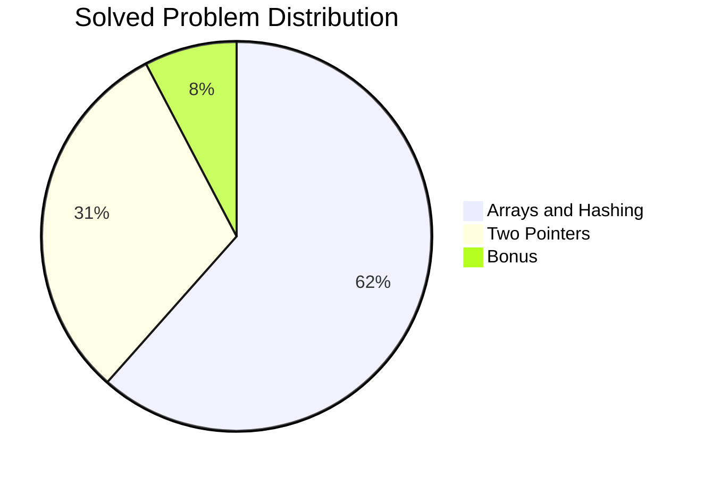
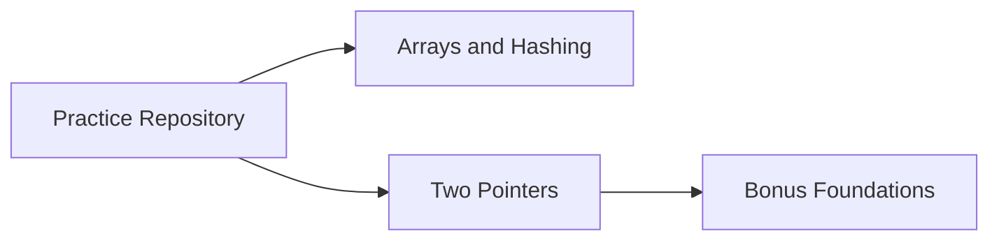

# SDE Practice Sheet Mastery

A structured Data Structures and Algorithms practice repository focused on pattern-based problem solving.

---

## Project Snapshot

<!-- AUTO:PROJECT_SNAPSHOT:START -->
| Metric | Value |
|---|---:|
| Total Problems Solved | 13 |
| Core Patterns Covered | 2 |
| Bonus Problems | 1 |

<!-- AUTO:PROJECT_SNAPSHOT:END -->

## Pattern Coverage

<!-- AUTO:PATTERN_COVERAGE:START -->

<!-- AUTO:PATTERN_COVERAGE:END -->

## Solved Problems

<!-- AUTO:SOLVED_PROBLEMS:START -->
### Arrays and Hashing (8)

| # | Problem | File |
|---:|---|---|
| 1 | LeetCode 1 - Two Sum | [Leetcode_1.py](Questions/Arrays%20and%20Hashing/Leetcode_1.py) |
| 2 | LeetCode 31 - Next Permutation | [Leetcode_31.py](Questions/Arrays%20and%20Hashing/Leetcode_31.py) |
| 3 | LeetCode 53 - Maximum Subarray | [Leetcode_53.py](Questions/Arrays%20and%20Hashing/Leetcode_53.py) |
| 4 | LeetCode 73 - Set Matrix Zeroes | [Leetcode_73.py](Questions/Arrays%20and%20Hashing/Leetcode_73.py) |
| 5 | LeetCode 118 - Pascal's Triangle | [Leetcode_118.py](Questions/Arrays%20and%20Hashing/Leetcode_118.py) |
| 6 | LeetCode 128 - Longest Consecutive Sequence | [Leetcode_128.py](Questions/Arrays%20and%20Hashing/Leetcode_128.py) |
| 7 | LeetCode 217 - Contains Duplicate | [Leetcode_217.py](Questions/Arrays%20and%20Hashing/Leetcode_217.py) |
| 8 | LeetCode 242 - Valid Anagram | [Leetcode_242.py](Questions/Arrays%20and%20Hashing/Leetcode_242.py) |

### Two Pointers (4)

| # | Problem | File |
|---:|---|---|
| 1 | LeetCode 11 - Container With Most Water | [Leetcode_11.py](Questions/Two%20Pointers/Leetcode_11.py) |
| 2 | LeetCode 15 - 3Sum | [Leetcode_15.py](Questions/Two%20Pointers/Leetcode_15.py) |
| 3 | LeetCode 42 - Trapping Rain Water | [Leetcode_42.py](Questions/Two%20Pointers/Leetcode_42.py) |
| 4 | LeetCode 125 - Valid Palindrome | [Leetcode_125.py](Questions/Two%20Pointers/Leetcode_125.py) |

### Bonus Foundations (1)

This track contains supporting questions that strengthen core techniques used in higher-level pattern problems.

| # | Problem | Why it matters | File |
|---:|---|---|---|
| 1 | LeetCode 167 - Two Sum II - Input Array Is Sorted | Builds sorted two-pointer intuition used in 3Sum-style problems | [Leetcode_Bonus_167.py](Questions/Two%20Pointers/Leetcode_Bonus_167.py) |
<!-- AUTO:SOLVED_PROBLEMS:END -->

---

